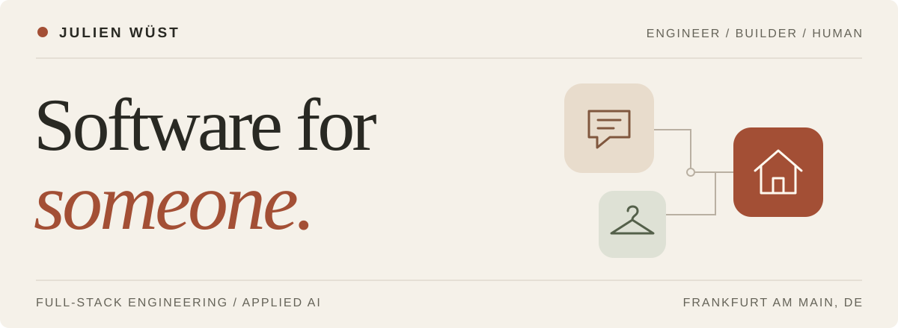
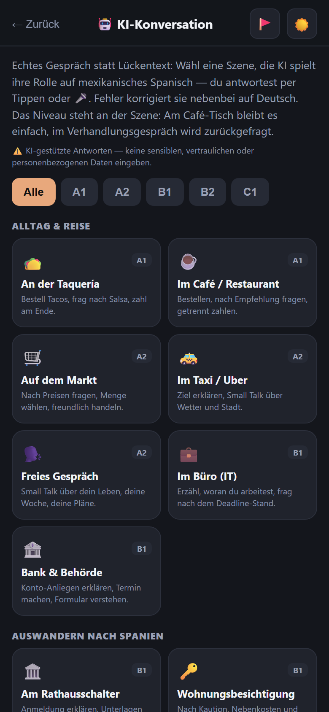
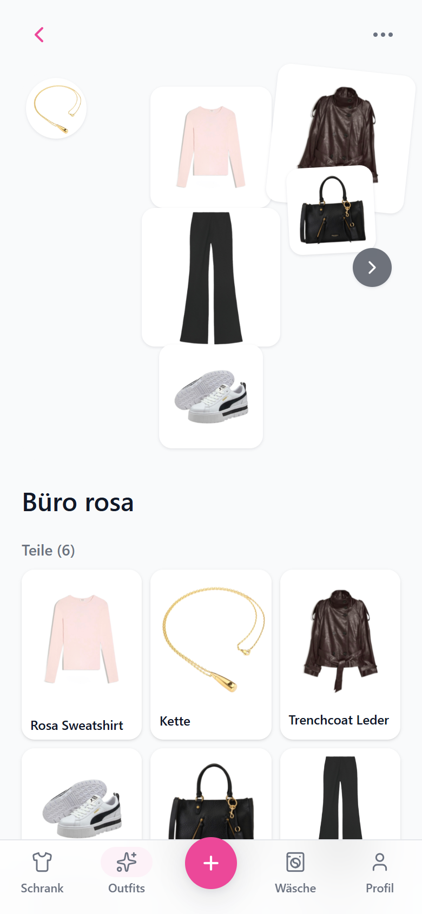
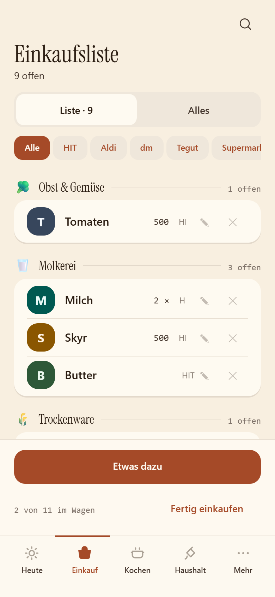

<picture>
  <source media="(prefers-color-scheme: dark)" srcset="./assets/header-dark.svg">
  <source media="(prefers-color-scheme: light)" srcset="./assets/header-light.svg">
  
</picture>

  <a href="https://julienwuest.de"><b>Portfolio</b></a>
  &nbsp;&nbsp; / &nbsp;&nbsp;
  <a href="https://julienwuest.de/#projectsPage">Project demos</a>
  &nbsp;&nbsp; / &nbsp;&nbsp;
  <a href="https://www.youtube.com/@ScenesWeKept">Beyond code</a>

# I'm Julien.

A software engineer near **Frankfurt am Main**, working as a **Technical Consultant at NTT DATA**. Full-stack engineering is my day-to-day; AI is increasingly part of what I build.

Outside work, my users are my fiancée, my family and me. A language app because the existing ones weren't quite right. A wardrobe app built around one person's wishes. A household app shaped by how we actually live.

**That's my favourite kind of brief: a real person, a specific problem, something worth making.**

## A few things I've made

These projects live in private repositories. The screenshots, demos and technical breakdowns are public on [my website](https://julienwuest.de/#projectsPage).

  
  &nbsp;
  
  &nbsp;
  

### 01 / Spanish Trainer
**Learning a language, not just keeping a streak.**

Built for my family and me, with a focus on Latin American Spanish and the grammar context I was missing elsewhere. Now supports French and English too. FSRS-6 schedules reviews; an AI conversation partner makes room for actual conversation.

React 19 · Firebase · Cloud Functions · Claude API · Offline-first PWA

### 02 / myCloset
**Her wardrobe. Her workflow.**

A digital wardrobe built for my fiancée, without the clutter of features she never asked for. Photograph a piece, remove its background right in the browser, build outfits and keep track of what's in the wash. The outfit finder puts together colour-matched looks from what's clean.

Angular 20 · Tailwind CSS · Firebase · ONNX Runtime · In-browser inference

### 03 / casita
**The little operating system for our home.** In progress

Shopping, cooking, calendars, chores and shared expenses for the two of us. The shopping list learns our route through the aisles. Recipes scale to who's eating. Expenses don't assume everything is fifty-fifty. Even the product illustrations show the food, not the packaging.

Expo Router · React Native Web · TypeScript · Supabase · Postgres RLS

**[Explore the demos and what's under the hood on my portfolio →](https://julienwuest.de/#projectsPage)**

## Different scale. Same attention to detail.

At work, I've been the sole full-stack developer for an enterprise banking-sector intranet: **Angular micro-frontends, C#/.NET, Azure AI Search and Cosmos DB**, including work on an Entra ID migration and automated CI/CD.

My background also includes evaluating **Domain-Driven Design for a 500K+ line legacy Java application** during my degree. I like understanding the system as much as building the next feature.

<b>A little more about my toolkit and what's next</b>

 

**Interfaces:** Angular, React, React Native Web, TypeScript. 
**Behind them:** C#/.NET, Firebase, Supabase, Azure AI Search, Cosmos DB. 
**Foundations:** B.Sc. in Software Technology, Azure infrastructure, Terraform and CI/CD.

Currently working toward **AI-103** and planning a self-hosted home lab. Further down the list: a RAG pipeline for my Obsidian vault and a C# agent to connect the services around it. Planned, not shipped.

## Away from the keyboard

Bouldering, calisthenics, a camera, and Spanish that's still a work in progress. My fiancée and I travel whenever we can and keep the memories on **[ScenesWeKept](https://www.youtube.com/@ScenesWeKept)**.

---

  <b>Code is part of the story.</b> 
  <a href="https://julienwuest.de">Here's the rest.</a>

